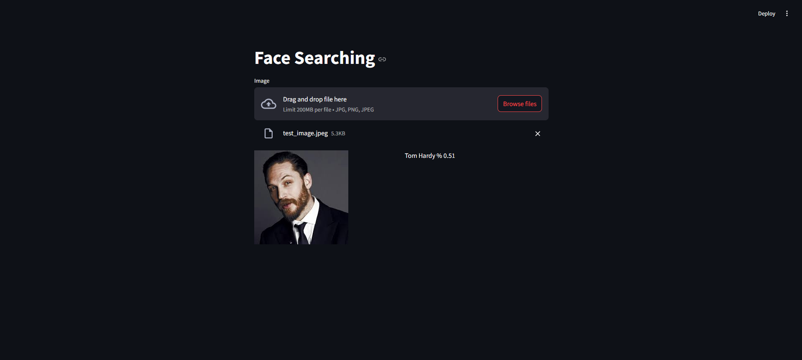

# Facial Recognition Project

This project is a facial recognition application that allows users to upload an image and search for matching faces from a pre-encoded dataset. The application uses Streamlit for the user interface, OpenCV for image processing, and face_recognition for face detection and encoding.

## Features

- Upload an image and find matching faces from a pre-encoded dataset.
- Display the uploaded image and matching results side by side.
- Provide feedback on the matching confidence level.

## Installation

### Clone the repository

```bash
git clone https://github.com/BlakeAmory/facial_recognition.git
cd Facial-Recognition
```

### Create and activate a virtual environment

```bash
python -m venv venv
source venv/bin/activate  # On Windows use `venv\Scripts\activate`
```

### Install the required packages

```bash
pip install -r requirements.txt
```

## Data Preparation

Place the images you want to encode in a folder, e.g., `Data`.

Run the encoding script to generate the encoded data:

```bash
python encode_faces.py
```

## Running the Application

Start the Streamlit application:

```bash
streamlit run main.py
```

Open the provided local URL in your web browser to use the application.

## Project Structure

```bash
face-searching-project/
│
├── encode_faces.py         # Script to encode faces from the dataset
├── main.py                 # Streamlit application script
├── EncodeFile.p            # Encoded data file
├── requirements.txt        # Required Python packages
└── README.md
|__ Data                    # Project documentation
```

## Scripts

### encode_faces.py

This script reads images from the specified folder, encodes the faces, and saves the encodings to a file.

### main.py

This script contains the Streamlit application that allows users to upload an image and find matching faces.

## Requirements

- Python 3.x
- face_recognition
- numpy
- opencv-python
- Pillow
- streamlit

Ensure all dependencies are installed by running:

```bash
pip install -r requirements.txt
```

## Results

The app can successfully recognize the people in the dataset. The image of Tom hardy is recognized as you can see below:



## Contributing

Feel free to open issues or submit pull requests for improvements and bug fixes.

## License

This project is under MIT license:

[](https://choosealicense.com/licenses/mit/)

## Feedback

If you have any feedback, please reach out to me at *<aliamani019@gmail.com>*.

## Authors

[@AliAmani](https://github.com/MrAliAmani)